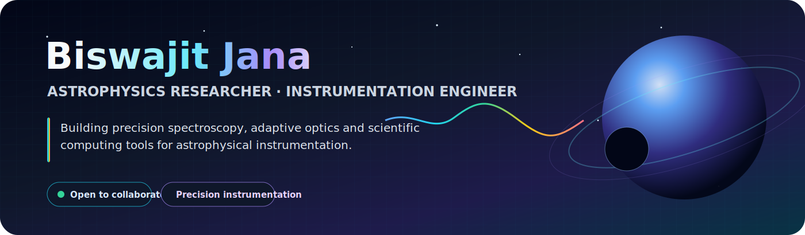
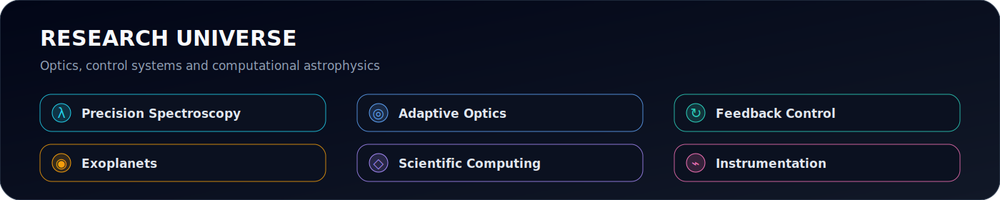
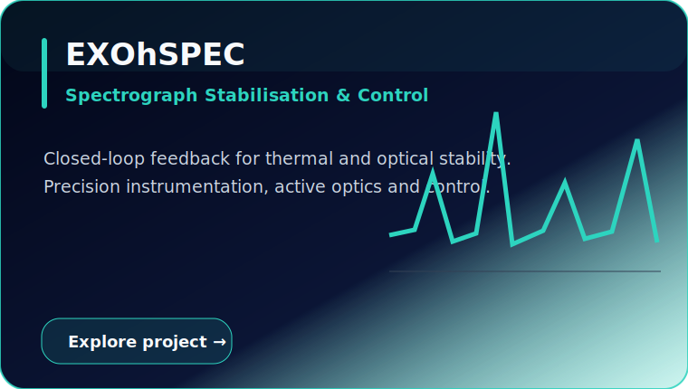
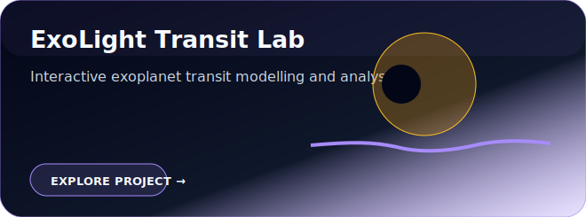
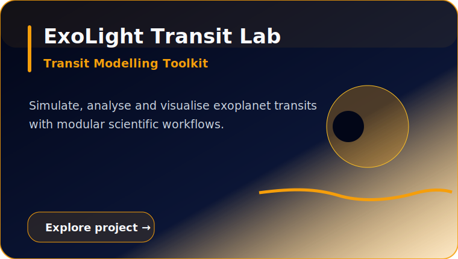
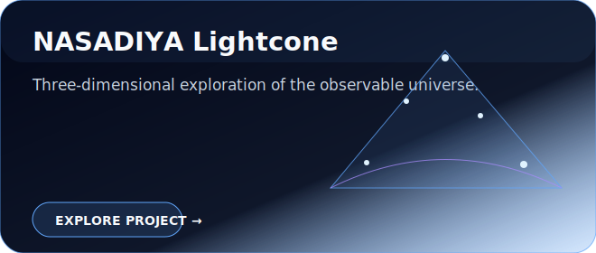
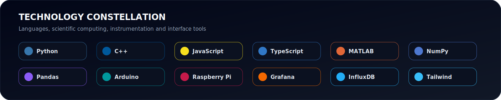

 

  

 

## ✦ Featured Research & Software

<table>
<tr>
<td width="50%">

</td>
<td width="50%">

</td>
</tr>
<tr>
<td width="50%">

</td>
<td width="50%">

</td>
</tr>
</table>

### More Interactive Research

  

  

  

## 🌌 Connect

  

