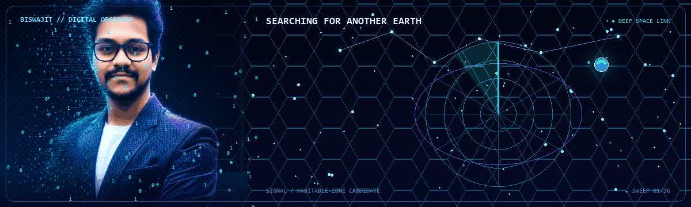
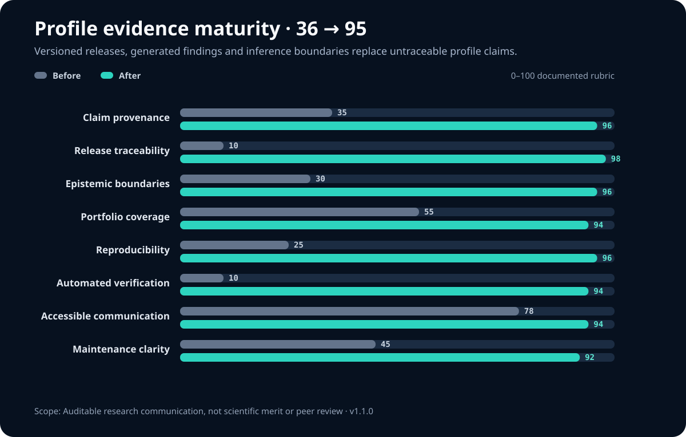
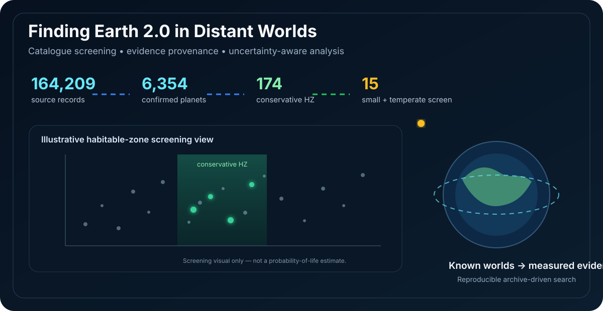
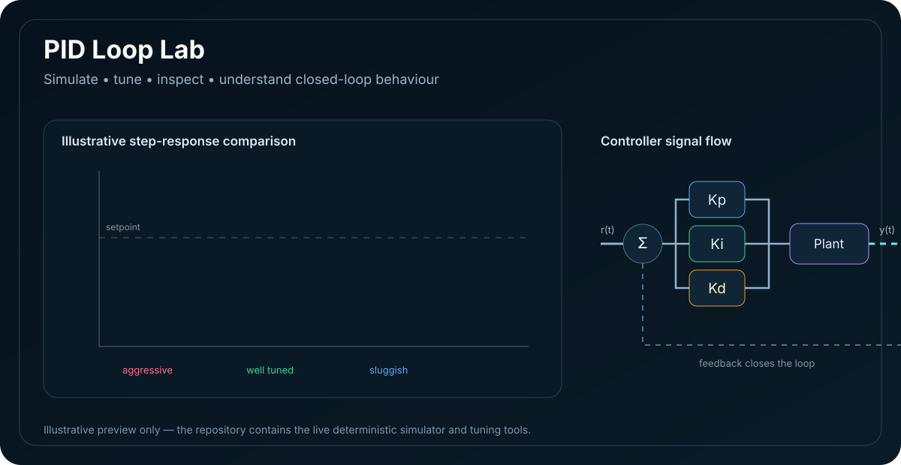
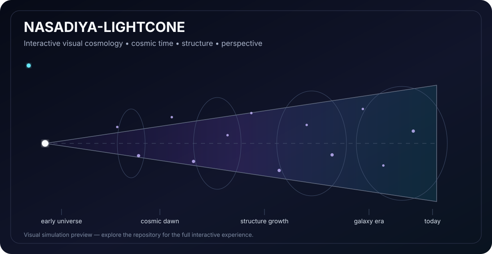
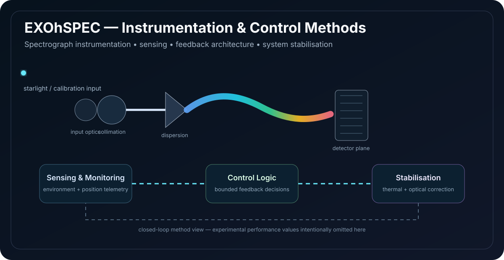

  

<h1 align="center">Hi, I'm Biswajit Jana 👋</h1>

  

  Precision Spectroscopy · Exoplanets · Active Optics · Feedback Control · Scientific Simulation

  
  
  
  

  
  
  

---

## 🔭 About Me

- MSc **Astrophysics with Advanced Research**, University of Hertfordshire, United Kingdom
- B.Tech **Electronics & Communication Engineering**, University of Engineering & Management (UEM), India
- Research focus: **exoplanet detection, spectroscopy and precision astronomical instrumentation**
- Building research software that connects **physics, simulation, data provenance, visualisation and instrument control**

---

## ✅ Verified Research Evidence

This profile now separates **versioned, reviewer-auditable evidence** from general project discovery. The current pinned snapshot routes to **7 verified upstream records in the 7/50 programme checkpoint** ([central registry v2026.09.19.3](https://github.com/Biswajit1999/Biswajit_Jana.github.io/releases/tag/v2026.09.19.3)). Each record includes a research question, generated result, source revision, release, validation evidence and an explicit boundary of inference.

| Repository | Verified release | Evidence focus |
| --- | --- | --- |
| [EPRV Spectrograph Landscape](https://github.com/Biswajit1999/eprv-spectrograph-landscape) | [v0.15.0](https://github.com/Biswajit1999/eprv-spectrograph-landscape/releases/tag/v0.15.0) | Resolving power × intrinsic line-width experiment |
| [ExoLight Transit Lab](https://github.com/Biswajit1999/exolight-transit-lab) | [v1.4.0](https://github.com/Biswajit1999/exolight-transit-lab/releases/tag/v1.4.0) | Correlated-noise interval-coverage experiment |
| [EXOhSPEC Th–Ar Atlas](https://github.com/Biswajit1999/exohspec-thar-atlas) | [v0.3.0](https://github.com/Biswajit1999/exohspec-thar-atlas/releases/tag/v0.3.0) | Multi-exposure centroid recovery simulation |
| [Research Evidence Registry](https://github.com/Biswajit1999/Biswajit_Jana.github.io) | [v2026.09.19.3](https://github.com/Biswajit1999/Biswajit_Jana.github.io/releases/tag/v2026.09.19.3) | Portfolio-wide claim and release traceability |
| [LATTICE Radiation Twin](https://github.com/Biswajit1999/lattice-radiation-twin) | [v0.2.0](https://github.com/Biswajit1999/lattice-radiation-twin/releases/tag/v0.2.0) | Negative component-identifiability result |
| [Finding Earth 2.0](https://github.com/Biswajit1999/finding-earth-2) | [v2.1.2](https://github.com/Biswajit1999/finding-earth-2/releases/tag/v2.1.2) | Objective-conditioned information transfer |
| [AstroBis](https://github.com/Biswajit1999/AstroBis) | [v1.3.1](https://github.com/Biswajit1999/AstroBis/releases/tag/v1.3.1) | JPL encounter-distance and albedo sensitivity |

[Read the generated evidence index](EVIDENCE.md) · [Inspect the machine-readable source](data/profile-evidence.json) · [Open the live central registry](https://biswajit1999.github.io/Biswajit_Jana.github.io/research-evidence.html)

  

> **Boundary.** The scores above measure auditable research communication—not scientific merit, peer review or a literal multiplier of research quality. Projects elsewhere on this page are **discovery-only** unless they appear in the verified table. Education, internship and publication summaries are profile narrative; project validation does not independently certify those biographical claims.

---

## 🔬 Research Focus

  
  
  
  
  
  
  
  

### Research Workflow

  
  ➜
  
  ➜
  
  ➜
  
  ➜
  

---

## ✨ Selected / Recently Updated Main Projects

A visual snapshot of selected research, simulation and interactive astronomy projects. The animated panels below are **profile-level visual summaries**; detailed methods, data, caveats and reproducibility material remain in the linked repositories.

<table>
<tr>
<td width="50%" valign="top">

 <strong>Finding Earth 2.0 in Distant Worlds</strong> 
Archive-driven exoplanet screening, habitable-zone analysis, uncertainty propagation and evidence-aware candidate assessment.  
<a href="https://github.com/Biswajit1999/finding-earth-2">Repository</a> · <a href="https://biswajit1999.github.io/finding-earth-2/">Interactive observatory</a>
</td>
<td width="50%" valign="top">

 <strong>PID Loop Lab</strong> 
Interactive control-system simulation with live P/I/D tuning, deterministic plant models, response metrics and explainable controller behaviour.  
<a href="https://github.com/Biswajit1999/pid-loop-lab">Repository</a> · <a href="https://biswajit1999.github.io/pid-loop-lab/">Live lab</a>
</td>
</tr>
<tr>
<td width="50%" valign="top">

 <strong>NASADIYA-LIGHTCONE</strong> 
A visual and computational exploration of cosmic time, large-scale structure and observational perspective across an evolving lightcone.  
<a href="https://github.com/Biswajit1999/NASADIYA-LIGHTCONE">Repository</a>
</td>
<td width="50%" valign="top">

 <strong>EXOhSPEC — Instrumentation &amp; Control Methods</strong> 
Public-safe overview of spectrograph instrumentation, sensing, feedback architecture and stabilisation methods. Main experimental performance results are intentionally not summarised on this profile.  
<a href="https://github.com/Biswajit1999/Master-Thesis-2024">Methods repository</a>
</td>
</tr>
</table>

  Visuals are animated SVG simulation/explainer panels designed for this profile. Numerical claims are kept tied to the corresponding project documentation.

---

## 🛰️ Recently Active Research Software

<table>
<tr>
<td width="50%">

</td>
<td width="50%">

</td>
</tr>
</table>

  
  
  

---

## 🧪 Current Instrumentation Work

### EXOhSPEC — closed-loop spectrograph methods

- Developing closed-loop architecture combining **thermal control and active optics**
- Using **interferometric sensing, PID/feedback logic and image-registration methods** for drift monitoring
- Studying how **environmental variables couple into precision instrumentation**
- Building real-time monitoring workflows with **Grafana and InfluxDB**
- Developing web-based instrument control and analysis tools with **HTML, CSS and JavaScript**
- This profile intentionally keeps EXOhSPEC at the **methods and system-architecture level** rather than reproducing the main experimental results

---

## 🚀 More Research & Simulation Projects

  
  
  
  

---

## 🧠 Research Experience

- Exoplanet detection using transit light curves and radial velocity
- Brown-dwarf atmospheric modelling for objects near **1100 K**
- Halo T-dwarf candidate identification using **VISTA, DES and WISE**
- Pulsar detection and analysis using large FITS datasets

---

## 🛰️ Internships & Research Programmes

- **LUMI SPACE** — Satellite Laser Ranging analysis
- **University of Hertfordshire** — Brown-dwarf discovery project
- **Raman Research Institute** — Radio interferometry
- **IIT Kharagpur** — Embedded systems and drone calibration

---

## 🧾 Publications

- Springer — Visible Light Communication using Raspberry Pi
- IEEE — Priority encoder in Quantum-dot Cellular Automata
- IEMECON — Smart IoT waste-management system

---

## 🛠️ Technical Skills

### Programming & Scientific Computing

  
  
  
  
  
  
  
  
  
  

### Instrumentation, Monitoring & Platforms

  
  
  
  
  
  
  
  
  

---

## 📊 GitHub Contribution Overview

  

  
  

  

### 🐍 Contribution Orbit

<picture>
  <source media="(prefers-color-scheme: dark)" srcset="https://raw.githubusercontent.com/Biswajit1999/Biswajit1999/output/github-contribution-grid-snake-dark.svg">
  <source media="(prefers-color-scheme: light)" srcset="https://raw.githubusercontent.com/Biswajit1999/Biswajit1999/output/github-contribution-grid-snake.svg">
  
</picture>

---

## 🎯 Current Goal

Building an astrophysics and instrumentation portfolio that connects:

- Physics and observational science
- Reproducible scientific computing
- Interactive visualisation and simulation
- Real experimental control systems
- Open, inspectable research software

---

## 🤝 Let's Connect

  
  
  

  ⭐ Explore the repositories below for the complete research, code, simulations and documentation.

## Research Quality Upgrade

See [RESEARCH_QUALITY.md](RESEARCH_QUALITY.md) for the evidence contract, deterministic build, test suite, maturity rubric and research boundaries used by this repository.
