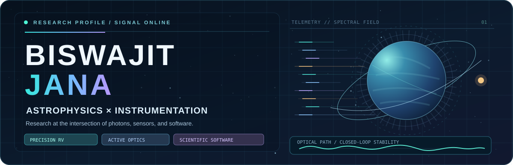
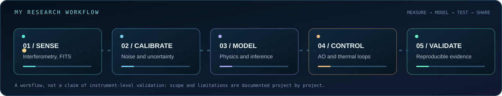
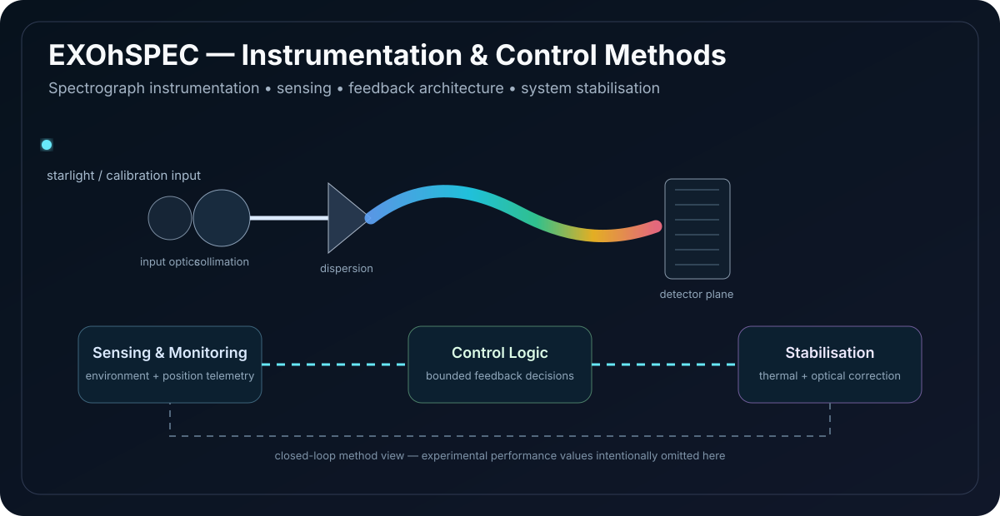
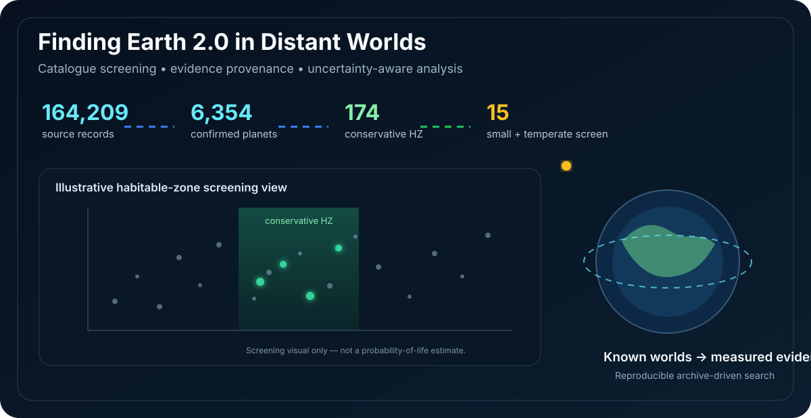
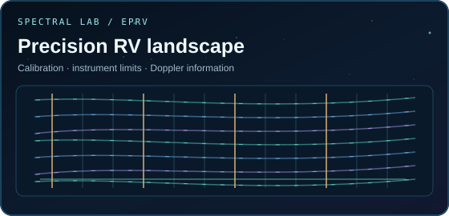
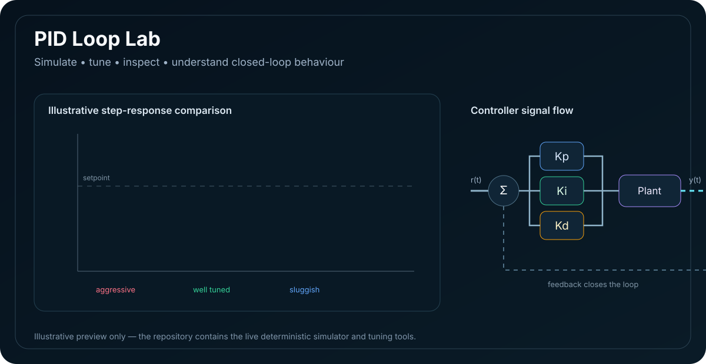
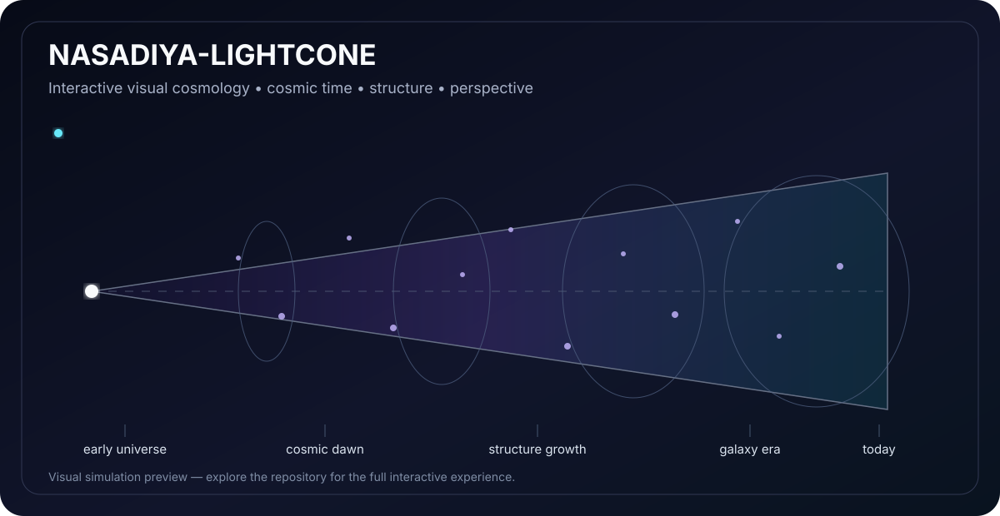
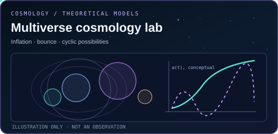

  

<h1 align="center">Biswajit Jana</h1>

  <strong>Astrophysics Researcher · Astronomical Instrumentation · Scientific Software</strong>

  Visiting Researcher, University of Hertfordshire, UK 
  MSc Astrophysics with Advanced Research (2024) · BTech Electronics &amp; Communication Engineering

  
  
  

  
  
  

---

## 01 / The researcher behind the projects

I work at the interface of **astronomy, electronics, experimental control and scientific computing**. I am particularly interested in the engineering problems that stand between a tiny astrophysical signal and a trustworthy measurement: optical-path stability, thermal drift, detector behaviour, calibration, precision radial velocity and uncertainty-aware inference.

My MSc research concerned **closed-loop feedback control for EXOhSPEC**, a high-resolution exoplanet spectrograph. I continue to explore instrumentation methods alongside open research software that lets people interrogate the data, assumptions and limitations behind an astronomical result.

**Education and research path**

| | Background |
| :-- | :-- |
| **Now** | **Visiting Researcher**, University of Hertfordshire — EXOhSPEC instrumentation, environmental telemetry and precision-stability methods. |
| **2022–2024** | **MSc Astrophysics with Advanced Research**, University of Hertfordshire, UK; Commendation. Thesis: *Closed-Loop Feedback Control System for EXOhSPEC Development*. Supervised by Prof Hugh R. A. Jones and Prof William E. Martin. |
| **2017–2021** | **BTech Electronics & Communication Engineering**, University of Engineering & Management (UEM), India; First Class with Distinction. Undergraduate work in optical wireless communication and embedded hardware. |
| **Further experience** | Satellite-laser-ranging detector studies (Lumi Space); brown-dwarf and survey-data analysis; radio interferometry (RRI programme); astronomical image processing, telescope work and embedded-system prototyping. |

> **Research direction:** precision RV instrumentation and calibration, exoplanet detection, detector characterisation, physical simulation and reproducible open science. Interested in PhD and research opportunities where instrumentation and astrophysics meet.

## 02 / From a photon to a defensible result

  

Three themes connect much of my work:

- **Instrument + environment** — interferometric metrology, active optics, thermal regulation, PID control and time-series telemetry.
- **Physics + data** — spectroscopy, exoplanet transits and radial velocity, survey catalogues, detector effects and uncertainty propagation.
- **Software + communication** — reproducible Python analyses, interactive browser laboratories, scientifically labelled visualisations and inspectable evidence.

## 03 / Selected research & software

These are **working repositories**, not decorative concept links. Each image is a conceptual or simulation-style illustration; see the linked repository for the actual data, experiment, validation status and scientific limits.

<table>
  <tr>
    <td width="50%" valign="top">
      
      <strong>EXOhSPEC / Precision Instrument Control</strong> 
      MSc thesis and subsequent laboratory development connecting laser interferometry, thermal feedback, detector-plane drift and active optics. Experimental findings and their boundaries are documented in the research record.  
      <a href="https://github.com/Biswajit1999/Master-Thesis-2024">Research record ↗</a>
    </td>
    <td width="50%" valign="top">
      
      <strong>Finding Earth 2.0</strong> 
      Provenance-aware exoplanet catalogue screening, habitable-zone candidates, observational selection effects and uncertainty-aware follow-up questions. Candidates are not claims of inhabited worlds.  
      <a href="https://github.com/Biswajit1999/finding-earth-2">Repository ↗</a> · <a href="https://biswajit1999.github.io/finding-earth-2/">Live observatory ↗</a>
    </td>
  </tr>
  <tr>
    <td width="50%" valign="top">
      
      <strong>EPRV Spectrograph Landscape</strong> 
      Source-linked research into RV spectrograph architectures, calibration practices, instrument-performance caveats and bounded Doppler-information experiments. Not an instrument ranking.  
      <a href="https://github.com/Biswajit1999/eprv-spectrograph-landscape">Research guide ↗</a> · <a href="https://biswajit1999.github.io/eprv-spectrograph-landscape/">Live explorer ↗</a>
    </td>
    <td width="50%" valign="top">
      
      <strong>PID Loop Lab</strong> 
      Browser-based controller laboratory with plant models, step responses, actuator limits, disturbances and interpretable P/I/D terms. An educational simulation, not a hardware commissioning certificate.  
      <a href="https://github.com/Biswajit1999/pid-loop-lab">Repository ↗</a> · <a href="https://biswajit1999.github.io/pid-loop-lab/">Launch lab ↗</a>
    </td>
  </tr>
  <tr>
    <td width="50%" valign="top">
      
      <strong>NASADIYA LIGHTCONE</strong> 
      A provenance-conscious visual research interface for observed galaxy surveys, cosmic time and large-scale structure, with separate browser and Python research modes.  
      <a href="https://github.com/Biswajit1999/NASADIYA-LIGHTCONE">Repository ↗</a> · <a href="https://biswajit1999.github.io/NASADIYA-LIGHTCONE/">Live explorer ↗</a>
    </td>
    <td width="50%" valign="top">
      
      <strong>Multiverse Cosmology Lab</strong> 
      A question-led learning and simulation project on inflation, reheating, eternal inflation, bounce and cyclic scenarios, separating observational constraints from speculative cosmological interpretations.  
      <a href="https://github.com/Biswajit1999/Multiverse">Research &amp; simulations ↗</a> · <a href="https://biswajit1999.github.io/Multiverse/">Interactive story ↗</a>
    </td>
  </tr>
</table>

### Other open research labs

| Observatory / lab | What you can investigate |
| :-- | :-- |
| [ExoLight Transit Lab](https://github.com/Biswajit1999/exolight-transit-lab) · [open](https://biswajit1999.github.io/exolight-transit-lab/) | Transit photometry, forward models, correlated noise and residual diagnostics. |
| [EXOhSPEC Th–Ar Atlas](https://github.com/Biswajit1999/exohspec-thar-atlas) · [open](https://biswajit1999.github.io/exohspec-thar-atlas/) | Controlled detector-domain calibration and centroid-recovery studies. |
| [LATTICE Radiation Twin](https://github.com/Biswajit1999/lattice-radiation-twin) · [open](https://biswajit1999.github.io/lattice-radiation-twin/) | Detector trailing and radiation-proxy inference; important falsification and identifiability limits. |
| [Betelgeuse Observatory](https://github.com/Biswajit1999/betelgeuse-observatory) · [open](https://biswajit1999.github.io/betelgeuse-observatory/) | Observable stellar variability, physical models and light-travel-time reasoning. |
| [EPRV Instrument Digital Twin](https://github.com/Biswajit1999/eprv-instrument-digital-twin) | Explicitly idealised thermal stability modelling for RV instrument systems. |
| [Dark Matter Lensing Auditor](https://github.com/Biswajit1999/dark-matter-lensing-auditor) | Research workflow focused on lensing evidence and scientific caveats. |

## 04 / Reproducible evidence, not just screenshots

Selected projects have an **auditable, versioned evidence trail**: a stated question, source revision, reproducible experiment, validation record and explicit boundary of inference.

The **September 2026 registry snapshot** indexes **7 upstream research records**. This is a version-pinned subset of the portfolio, **not** a claim that all repositories have been independently validated or peer reviewed.

| Research record | Evidence snapshot |
| :-- | :-- |
| [EPRV Spectrograph Landscape](https://github.com/Biswajit1999/eprv-spectrograph-landscape) | [v0.15.0](https://github.com/Biswajit1999/eprv-spectrograph-landscape/releases/tag/v0.15.0) — controlled resolving-power and line-width experiment |
| [ExoLight Transit Lab](https://github.com/Biswajit1999/exolight-transit-lab) | [v1.4.0](https://github.com/Biswajit1999/exolight-transit-lab/releases/tag/v1.4.0) — correlated-noise interval-coverage experiment |
| [EXOhSPEC Th–Ar Atlas](https://github.com/Biswajit1999/exohspec-thar-atlas) | [v0.3.0](https://github.com/Biswajit1999/exohspec-thar-atlas/releases/tag/v0.3.0) — simulated multi-exposure centroid recovery |
| [Research Evidence Registry](https://github.com/Biswajit1999/Biswajit_Jana.github.io) | [v2026.09.19.3](https://github.com/Biswajit1999/Biswajit_Jana.github.io/releases/tag/v2026.09.19.3) — cross-repository traceability |
| [LATTICE Radiation Twin](https://github.com/Biswajit1999/lattice-radiation-twin) | [v0.2.0](https://github.com/Biswajit1999/lattice-radiation-twin/releases/tag/v0.2.0) — negative identifiability finding |
| [Finding Earth 2.0](https://github.com/Biswajit1999/finding-earth-2) | [v2.1.2](https://github.com/Biswajit1999/finding-earth-2/releases/tag/v2.1.2) — follow-up value/covariance sensitivity |
| [AstroBis](https://github.com/Biswajit1999/AstroBis) | [v1.3.1](https://github.com/Biswajit1999/AstroBis/releases/tag/v1.3.1) — small-body screening sensitivity |

**[Read the evidence index →](EVIDENCE.md)** · **[Explore the live registry →](https://biswajit1999.github.io/Biswajit_Jana.github.io/research-evidence.html)** · [Machine-readable snapshot](data/profile-evidence.json)

## 05 / Engineering & scientific toolkit

| Area | Tools & practice |
| :-- | :-- |
| **Scientific computing** | Python, NumPy, SciPy, pandas, Astropy, Jupyter, MATLAB, Matplotlib, C/C++, numerical modelling and uncertainty analysis |
| **Instrumentation** | Laser interferometry, IDS3010, adaptive optics, optical sensing, CCD/CMOS imaging, spectrograph stabilisation, PID feedback, serial instrument interfaces |
| **Telemetry & embedded** | InfluxDB, Grafana, PT104, Meerstetter TEC, Arduino, Raspberry Pi, PSoC, NodeMCU, automated acquisition |
| **Interactive research software** | JavaScript, TypeScript, HTML/CSS, browser visualisation, data provenance, Git/GitHub, documentation and reproducible workflows |

  
  
  
  
  
  
  
  
  
  

## 06 / Publications & research communication

My published work began in **electronics and optical communications**; current astrophysics repositories are described by their actual project and evidence status rather than presented as refereed journal articles.

1. **Implementation of dimming controlled visible light communication using Raspberry Pi** — *Optical and Quantum Electronics* **53**, 725 (2021). [DOI: 10.1007/s11082-021-03362-4](https://doi.org/10.1007/s11082-021-03362-4)
2. **Priority encoder using reversible logic gates in QCA** — IEEE IEMCON (2017). [DOI: 10.1109/IEMCON.2017.8117242](https://doi.org/10.1109/IEMCON.2017.8117242)
3. **GSM Controlled Location Specific Garbage Collecting Smart Bin** — IEEE IEMECON (2019). [DOI: 10.1109/IEMECONX.2019.8877007](https://doi.org/10.1109/IEMECONX.2019.8877007)

Beyond publications: EXOhSPEC research presentations; detector and satellite-laser-ranging poster work; exoplanet and substellar analysis; visual explainers built to make difficult physical concepts approachable.

**[Academic CV & research background →](https://biswajit1999.github.io/Biswajit_Jana.github.io/cv.html)**

## 07 / GitHub signal

  

  <a href="https://github.com/Biswajit1999?tab=repositories"><strong>Explore all repositories →</strong></a>
  &nbsp;·&nbsp;
  <a href="https://biswajit1999.github.io/Biswajit_Jana.github.io/"><strong>Visit my portfolio →</strong></a>
  &nbsp;·&nbsp;
  <a href="mailto:biswajitj998@gmail.com"><strong>Discuss research →</strong></a>

  Created and maintained by <strong>Biswajit Jana</strong>. Profile diagrams are explanatory artwork, not substitute measurements or astronomical photographs. © 2026.

