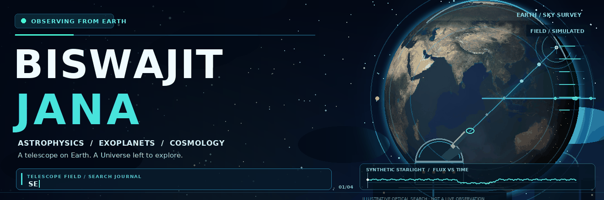
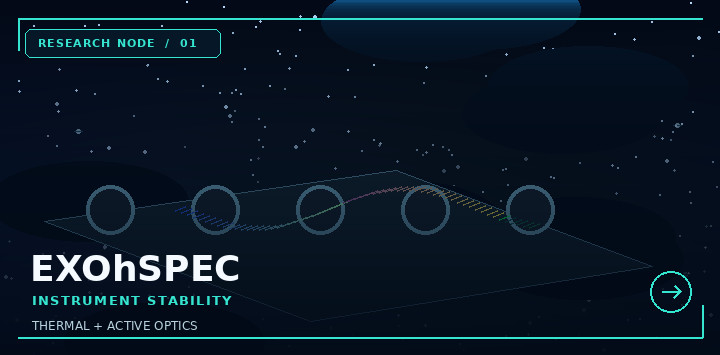
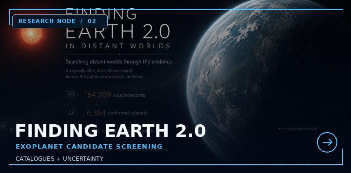
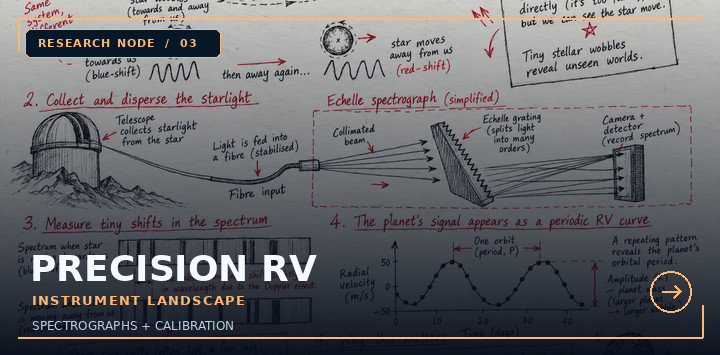
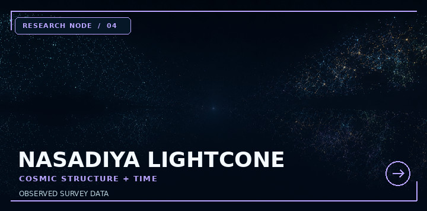

<!-- Profile cover only. Detailed science, methods and publications live in the linked research repositories. -->

  

  <strong>Astrophysics · Astronomical Instrumentation · Scientific Computing</strong> 
  <em>From photons and precision sensors to exoplanets, instrument stability and reproducible discovery.</em>

  <a href="https://biswajit1999.github.io/Biswajit_Jana.github.io/"><strong>Portfolio / research ↗</strong></a> &nbsp;·&nbsp;
  <a href="https://github.com/Biswajit1999?tab=repositories"><strong>Explore projects ↗</strong></a> &nbsp;·&nbsp;
  <a href="https://www.linkedin.com/in/biswajit-jana-27011a151/"><strong>LinkedIn ↗</strong></a> &nbsp;·&nbsp;
  <a href="mailto:biswajitj998@gmail.com"><strong>Contact ↗</strong></a>

---

### Curious about the science behind the visuals?

I'm a **Visiting Researcher at the University of Hertfordshire**, with an **MSc in Astrophysics with Advanced Research** and a **BTech in Electronics & Communication Engineering**. My work spans **precision radial-velocity instrumentation**, **feedback and active optics**, **exoplanet science** and **reproducible scientific software**.

*How do we turn an extremely faint signal into a trustworthy measurement?* That's the question connecting these projects.

### Featured research / select a signal

<table>
<tr>
<td width="50%" valign="top">

<strong>EXOhSPEC</strong> · <em>Can thermal control and active optics keep a high-resolution spectrograph stable over long runs?</em> 
<a href="https://github.com/Biswajit1999/Master-Thesis-2024"><strong>Explore experimental record →</strong></a>
</td>
<td width="50%" valign="top">

<strong>Finding Earth 2.0</strong> · <em>Which of the known exoplanets survive a reproducible, uncertainty-aware search for small temperate worlds?</em> 
<a href="https://github.com/Biswajit1999/finding-earth-2"><strong>Follow the evidence →</strong></a>
</td>
</tr>
<tr>
<td width="50%" valign="top">

<strong>Precision RV Landscape</strong> · <em>What really determines an instrument's Doppler sensitivity, and which published figures are comparable?</em> 
<a href="https://github.com/Biswajit1999/eprv-spectrograph-landscape"><strong>Explore the instrument guide →</strong></a>
</td>
<td width="50%" valign="top">

<strong>NASADIYA LIGHTCONE</strong> · <em>What does the large-scale Universe look like when every plotted galaxy comes from a real survey?</em> 
<a href="https://github.com/Biswajit1999/NASADIYA-LIGHTCONE"><strong>Explore the cosmic lightcone →</strong></a>
</td>
</tr>
</table>

Project panels are **conceptual visual summaries**, not observational photographs or experimental measurements. The linked repositories distinguish simulations, data, validation and scientific limitations.

### Other experiments worth exploring

**[ExoLight Transit Lab](https://github.com/Biswajit1999/exolight-transit-lab)** · transit photometry &nbsp;·&nbsp;
**[PID Loop Lab](https://github.com/Biswajit1999/pid-loop-lab)** · feedback simulation &nbsp;·&nbsp;
**[LATTICE](https://github.com/Biswajit1999/lattice-radiation-twin)** · detector effects &nbsp;·&nbsp;
**[Betelgeuse Observatory](https://github.com/Biswajit1999/betelgeuse-observatory)** · stellar physics &nbsp;·&nbsp;
**[Multiverse](https://github.com/Biswajit1999/Multiverse)** · cosmological models &nbsp;·&nbsp;
**[EXOhSPEC Th–Ar Atlas](https://github.com/Biswajit1999/exohspec-thar-atlas)** · wavelength-calibration studies

**Research toolkit:** Python · MATLAB · C/C++ · astrophysics · laser interferometry · optical imaging · feedback control · Astropy · CCD/CMOS · Grafana/InfluxDB.

<strong>Verified Research Evidence</strong> · 7 versioned records and limitations

 
The <strong>v2026.09.19.3</strong> snapshot routes to <strong>7 verified upstream records</strong>. These are auditable research-software evidence entries, <em>not</em> independent peer review. Projects beyond this pinned subset are <strong>discovery-only</strong> links, not validated by this registry.

<ul>
<li><a href="https://github.com/Biswajit1999/eprv-spectrograph-landscape/releases/tag/v0.15.0"><strong>EPRV Spectrograph Landscape</strong> · v0.15.0</a></li>
<li><a href="https://github.com/Biswajit1999/exolight-transit-lab/releases/tag/v1.4.0"><strong>ExoLight Transit Lab</strong> · v1.4.0</a></li>
<li><a href="https://github.com/Biswajit1999/exohspec-thar-atlas/releases/tag/v0.3.0"><strong>EXOhSPEC Th-Ar Atlas</strong> · v0.3.0</a></li>
<li><a href="https://github.com/Biswajit1999/Biswajit_Jana.github.io/releases/tag/v2026.09.19.3"><strong>Research Portfolio Evidence Registry</strong> · v2026.09.19.3</a></li>
<li><a href="https://github.com/Biswajit1999/lattice-radiation-twin/releases/tag/v0.2.0"><strong>LATTICE Radiation Twin</strong> · v0.2.0</a></li>
<li><a href="https://github.com/Biswajit1999/finding-earth-2/releases/tag/v2.1.2"><strong>Finding Earth 2.0</strong> · v2.1.2</a></li>
<li><a href="https://github.com/Biswajit1999/AstroBis/releases/tag/v1.3.1"><strong>AstroBis Small-Body Evidence</strong> · v1.3.1</a></li>
</ul>

<a href="EVIDENCE.md"><strong>Read research questions, results and limits →</strong></a> · <a href="data/profile-evidence.json">Machine-readable evidence</a>

---

  <strong>Better instruments. Clearer data. Deeper questions.</strong> 
  <a href="https://biswajit1999.github.io/Biswajit_Jana.github.io/">Full portfolio</a> ·
  <a href="https://github.com/Biswajit1999?tab=repositories">Repositories</a> ·
  <a href="mailto:biswajitj998@gmail.com">Let's connect</a>

  <picture>
    <source media="(prefers-color-scheme: dark)" srcset="https://raw.githubusercontent.com/Biswajit1999/Biswajit1999/output/github-contribution-grid-snake-dark.svg">
    <source media="(prefers-color-scheme: light)" srcset="https://raw.githubusercontent.com/Biswajit1999/Biswajit1999/output/github-contribution-grid-snake.svg">
    
  </picture>

Biswajit Jana · © 2026 · Original diagrams and renderings are illustrative.

