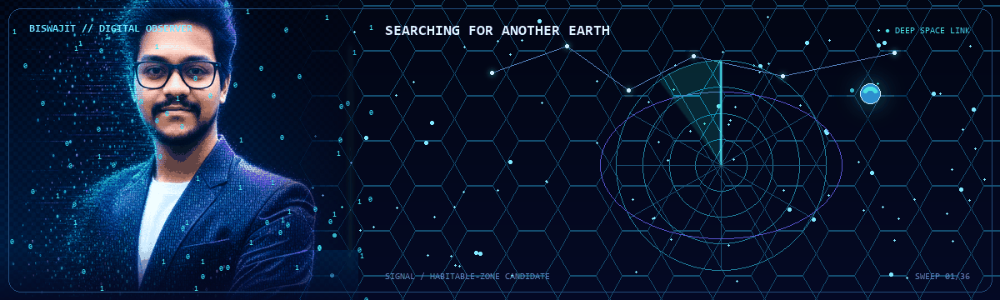

<!-- GitHub profile cover: the research portfolio hosts the full biography, projects and papers. -->

  

<h1 align="center">Biswajit Jana</h1>

  <strong>Astrophysics Researcher &nbsp;·&nbsp; Astronomical Instrumentation &nbsp;·&nbsp; Scientific Computing</strong>

  <em>From photons and precision sensors to exoplanets, instrument stability and reproducible discovery.</em>

  <a href="https://biswajit1999.github.io/Biswajit_Jana.github.io/"><strong>Research portfolio ↗</strong></a>
  &nbsp;&nbsp;·&nbsp;&nbsp;
  <a href="https://github.com/Biswajit1999?tab=repositories"><strong>All repositories ↗</strong></a>
  &nbsp;&nbsp;·&nbsp;&nbsp;
  <a href="https://www.linkedin.com/in/biswajit-jana-27011a151/"><strong>LinkedIn ↗</strong></a>
  &nbsp;&nbsp;·&nbsp;&nbsp;
  <a href="mailto:biswajitj998@gmail.com"><strong>Email ↗</strong></a>

---

### A little about my work

I'm a **Visiting Researcher at the University of Hertfordshire**, with an **MSc in Astrophysics with Advanced Research** and a **BTech in Electronics & Communication Engineering**. My research interests connect **high-precision radial velocity spectroscopy**, **active optics and closed-loop feedback**, **exoplanet science**, and **scientific software**.

The question that drives much of my work: ***how do we turn extremely small astrophysical signals into measurements we can actually trust?***

### Selected research · four doors into the lab

<em>These previews come from the linked research projects. Open a repository for methods, data provenance, experiments and limitations; launch an existing interactive tool where available.</em>

<table>
  <tr>
    <td width="50%" valign="top">
      
      <strong>01 / EXOhSPEC — Keeping light stable</strong> 
      <em>Can thermal regulation and active optics suppress spectrograph image motion over long laboratory runs?</em>  
      <a href="https://github.com/Biswajit1999/Master-Thesis-2024"><strong>Experimental record ↗</strong></a>
    </td>
    <td width="50%" valign="top">
      
      <strong>02 / Finding Earth 2.0 — Searching distant worlds</strong> 
      <em>From astronomical catalogues to a carefully defined shortlist of small, temperate planets.</em>  
      <a href="https://github.com/Biswajit1999/finding-earth-2"><strong>Research ↗</strong></a> · <a href="https://biswajit1999.github.io/finding-earth-2/">Interactive observatory ↗</a>
    </td>
  </tr>
  <tr>
    <td width="50%" valign="top">
      
      <strong>03 / Precision RV — The instrument behind the signal</strong> 
      <em>Exploring spectrograph architectures, wavelength calibration and the limits of Doppler information.</em>  
      <a href="https://github.com/Biswajit1999/eprv-spectrograph-landscape"><strong>Research guide ↗</strong></a> · <a href="https://biswajit1999.github.io/eprv-spectrograph-landscape/">Instrument explorer ↗</a>
    </td>
    <td width="50%" valign="top">
      
      <strong>04 / NASADIYA LIGHTCONE — Reading cosmic time</strong> 
      <em>Exploring the large-scale Universe through observed survey catalogues, not an invented cosmic web.</em>  
      <a href="https://github.com/Biswajit1999/NASADIYA-LIGHTCONE"><strong>Research ↗</strong></a> · <a href="https://biswajit1999.github.io/NASADIYA-LIGHTCONE/">3D explorer ↗</a>
    </td>
  </tr>
</table>

### Beyond these four

**[ExoLight Transit Lab](https://github.com/Biswajit1999/exolight-transit-lab)** · transit photometry and residuals &nbsp; | &nbsp; **[PID Loop Lab](https://github.com/Biswajit1999/pid-loop-lab)** · control-system simulation &nbsp; | &nbsp; **[LATTICE](https://github.com/Biswajit1999/lattice-radiation-twin)** · detector effects

**[Multiverse Cosmology Lab](https://github.com/Biswajit1999/Multiverse)** · inflation and cosmic origins &nbsp; | &nbsp; **[Betelgeuse Observatory](https://github.com/Biswajit1999/betelgeuse-observatory)** · stellar physics &nbsp; | &nbsp; **[EXOhSPEC Th–Ar Atlas](https://github.com/Biswajit1999/exohspec-thar-atlas)** · spectral calibration

**Tools I work with:** Python · MATLAB · C/C++ · Astropy · spectroscopy · interferometry · CCD/CMOS imaging · PID control · Arduino/Raspberry Pi · Grafana/InfluxDB.

**Evidence matters.** A selection of my experiments is indexed with versioned releases, reproducibility records and clearly stated limits: **[browse the research evidence ↗](EVIDENCE.md)**. The index is a bounded research record, *not* a claim of independent peer review.

---

  <strong>Curious about the experiments behind the images?</strong> 
  <a href="https://biswajit1999.github.io/Biswajit_Jana.github.io/">Full research portfolio</a>
  &nbsp;·&nbsp;
  <a href="https://github.com/Biswajit1999?tab=repositories">Explore the code</a>
  &nbsp;·&nbsp;
  <a href="mailto:biswajitj998@gmail.com">Get in touch</a>

  <picture>
    <source media="(prefers-color-scheme: dark)" srcset="https://raw.githubusercontent.com/Biswajit1999/Biswajit1999/output/github-contribution-grid-snake-dark.svg">
    <source media="(prefers-color-scheme: light)" srcset="https://raw.githubusercontent.com/Biswajit1999/Biswajit1999/output/github-contribution-grid-snake.svg">
    
  </picture>

Biswajit Jana · Research, engineering and scientific visualisation · © 2026

