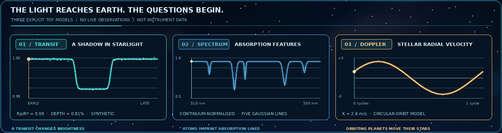
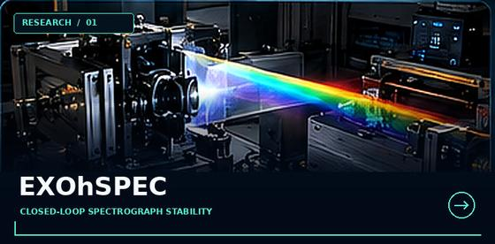
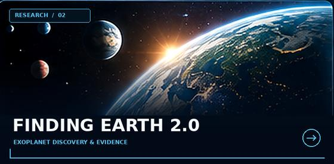
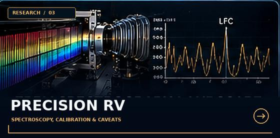
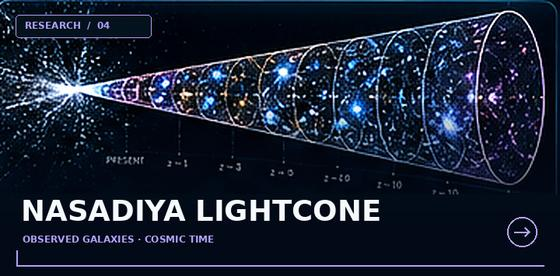

<!-- GitHub profile cover: a visual entry point to the existing research portfolio. -->

  <a href="https://github.com/Biswajit1999?tab=repositories">
    <picture>
      <source media="(prefers-reduced-motion: reduce)" srcset="./assets/profile-cinema/hero-preview.jpg">
      
    </picture>
  </a>

  

  <strong>Astrophysics researcher</strong> · Exoplanets · Precision spectroscopy · Cosmology · Scientific computing

  <a href="#signal-lab"><strong>✦ Observe the signal ↓</strong></a>
  &nbsp;·&nbsp;
  <a href="#featured-missions"><strong>✦ Explore the missions ↓</strong></a>
  &nbsp;·&nbsp;
  <a href="https://biswajit1999.github.io/Biswajit_Jana.github.io/"><strong>Research portfolio ↗</strong></a>
  &nbsp;·&nbsp;
  <a href="mailto:biswajitj998@gmail.com"><strong>Contact ↗</strong></a>

---

### From our planet, looking outward

I'm a **Visiting Researcher at the University of Hertfordshire**, with an **MSc in Astrophysics with Advanced Research** and a background in **Electronics & Communication Engineering**. I explore the meeting point of **astronomical instruments, exoplanet discovery, optical measurements, and computational astronomy**.

*What can we learn about a world we may never visit—just by studying the light that reaches Earth?*

### Signal Lab

**Three ways of reading starlight.** Watch the simulated observations progress from a planet crossing a star, to absorption lines in a spectrum, to a star's tiny radial-velocity wobble.

  <picture>
    <source media="(prefers-reduced-motion: reduce)" srcset="./assets/profile-cinema/deep-sky-telemetry.jpg">
    
  </picture>

  Numerically generated examples, <strong>not live observations or telescope measurements</strong>. The light curve, spectrum and RV waveform demonstrate physical concepts rather than any claimed planetary detection.

  <a href="https://github.com/Biswajit1999/exolight-transit-lab"><strong>Explore transit photometry ↗</strong></a>
  &nbsp;·&nbsp;
  <a href="https://github.com/Biswajit1999/eprv-spectrograph-landscape"><strong>Study precision RV ↗</strong></a>
  &nbsp;·&nbsp;
  <a href="https://github.com/Biswajit1999/Master-Thesis-2024"><strong>Inside the instrument ↗</strong></a>

### Featured Missions

<table>
<tr>
<td width="50%" valign="top">

<strong>01 · EXOhSPEC</strong> 
<em>How stable must an instrument be to study the tiniest changes in starlight?</em> 
<a href="https://github.com/Biswajit1999/Master-Thesis-2024"><strong>Explore the instrument ↗</strong></a>
</td>
<td width="50%" valign="top">

<strong>02 · Finding Earth 2.0</strong> 
<em>Which known planets could resemble our home, and what do we still not know?</em> 
<a href="https://github.com/Biswajit1999/finding-earth-2"><strong>Search distant worlds ↗</strong></a>
</td>
</tr>
<tr>
<td width="50%" valign="top">

<strong>03 · Precision RV Landscape</strong> 
<em>How can a star's changing spectrum reveal an otherwise unseen planet?</em> 
<a href="https://github.com/Biswajit1999/eprv-spectrograph-landscape"><strong>Follow the Doppler signal ↗</strong></a>
</td>
<td width="50%" valign="top">

<strong>04 · NASADIYA LIGHTCONE</strong> 
<em>What does the Universe reveal when we look back across cosmic time?</em> 
<a href="https://github.com/Biswajit1999/NASADIYA-LIGHTCONE"><strong>Explore the lightcone ↗</strong></a>
</td>
</tr>
</table>

The radar and light curve are <em>illustrative simulations</em>, not real-time observations or claims of a detected signal. Open each repository for its methods and source data.

### Further into the Universe

**[ExoLight Transit Lab](https://github.com/Biswajit1999/exolight-transit-lab)** · stellar light curves &nbsp; ✦ &nbsp;
**[Betelgeuse Observatory](https://github.com/Biswajit1999/betelgeuse-observatory)** · red-supergiant physics &nbsp; ✦ &nbsp;
**[Multiverse Cosmology Lab](https://github.com/Biswajit1999/Multiverse)** · cosmic origins &nbsp; ✦ &nbsp;
**[LATTICE](https://github.com/Biswajit1999/lattice-radiation-twin)** · space detectors

**A few tools I use:** Python · Astropy · MATLAB · C/C++ · spectroscopy · astronomical imaging · numerical modelling · data visualisation.

---

  <strong>Curiosity begins with a signal.</strong> 
  <em>From Earth to the faintest light of the distant Universe.</em> 
  <a href="https://biswajit1999.github.io/Biswajit_Jana.github.io/">Research portfolio ↗</a> ·
  <a href="https://github.com/Biswajit1999?tab=repositories">All projects ↗</a> ·
  <a href="https://www.linkedin.com/in/biswajit-jana-27011a151/">Connect ↗</a>

  <picture>
    <source media="(prefers-color-scheme: dark)" srcset="https://raw.githubusercontent.com/Biswajit1999/Biswajit1999/output/github-contribution-grid-snake-dark.svg">
    <source media="(prefers-color-scheme: light)" srcset="https://raw.githubusercontent.com/Biswajit1999/Biswajit1999/output/github-contribution-grid-snake.svg">
    
  </picture>

Biswajit Jana · 2026

